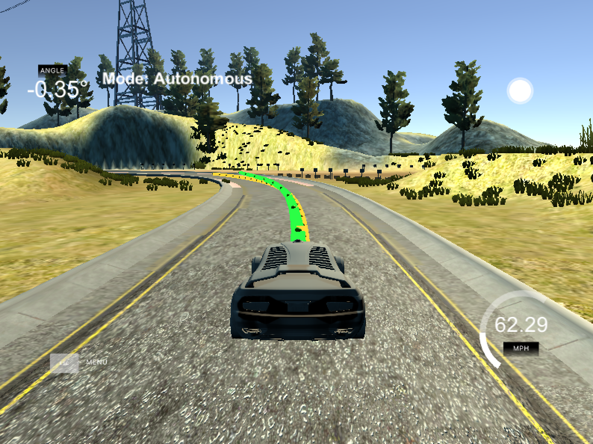
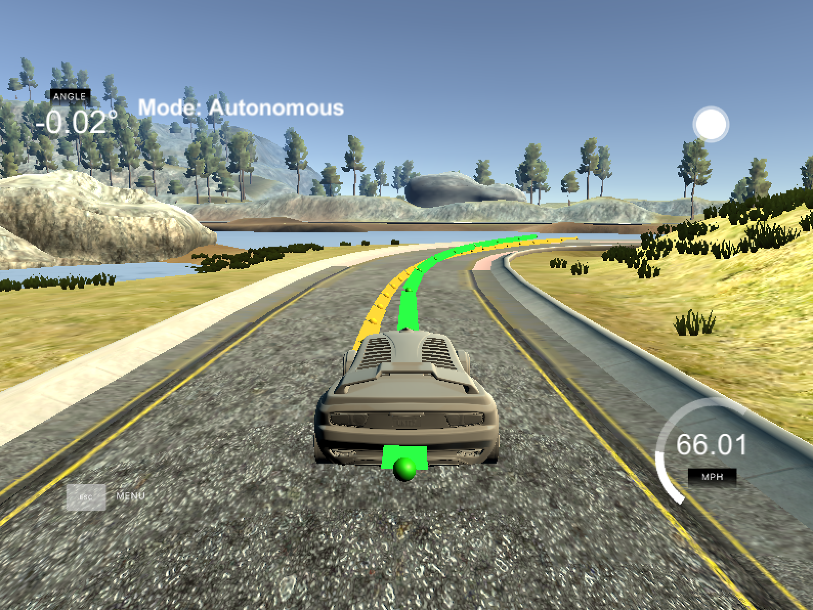
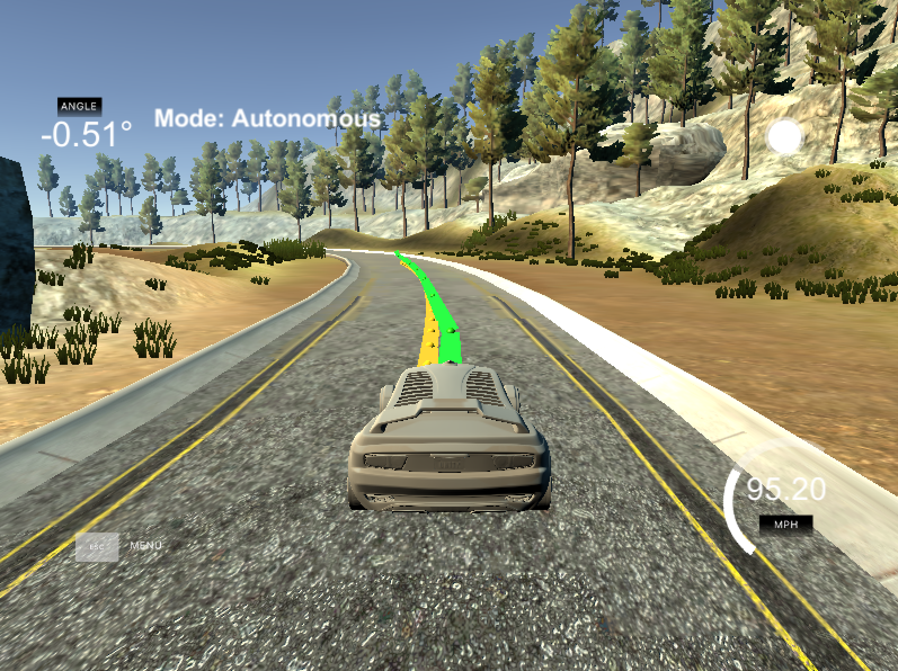

# SelfDrivingCar-P10-MPC-Project
Self-Driving Car Engineer Nanodegree Program

---

The purpose of this project is to implement a model predictive controller (MPC) to drive a vehicle along a desired path (reference trajectory). It is tested in a simulator provided by Udacity. The simulator outputs x and y positions, speed, and orientation of the vehicle along with the reference trajectory.

In the simulator, the reference trajectory is show as a **YELLOW** line and the predicted path is in **GREEN**.  

The following three sample images show the car driving on the track in the simulator.  
* **Vehicle driving 62 mph in a left-turn curve**   

* **Vehicle driving 66 mph in a right-turn curve**  

* **Vehicle driving 95 mph in as traighter path with speed limit set to 100 mph**  


## Dependencies

* cmake >= 3.5
 * All OSes: [click here for installation instructions](https://cmake.org/install/)
* make >= 4.1
  * Linux: make is installed by default on most Linux distros
  * Mac: [install Xcode command line tools to get make](https://developer.apple.com/xcode/features/)
  * Windows: [Click here for installation instructions](http://gnuwin32.sourceforge.net/packages/make.htm)
* gcc/g++ >= 5.4
  * Linux: gcc / g++ is installed by default on most Linux distros
  * Mac: same deal as make - [install Xcode command line tools]((https://developer.apple.com/xcode/features/)
  * Windows: recommend using [MinGW](http://www.mingw.org/)
* [uWebSockets](https://github.com/uWebSockets/uWebSockets)
  * Run either `install-mac.sh` or `install-ubuntu.sh`.
  * If you install from source, checkout to commit `e94b6e1`, i.e.
    ```
    git clone https://github.com/uWebSockets/uWebSockets 
    cd uWebSockets
    git checkout e94b6e1
    ```
    Some function signatures have changed in v0.14.x. See [this PR](https://github.com/udacity/CarND-MPC-Project/pull/3) for more details.
* Fortran Compiler
  * Mac: `brew install gcc` (might not be required)
  * Linux: `sudo apt-get install gfortran`. Additionall you have also have to install gcc and g++, `sudo apt-get install gcc g++`. Look in [this Dockerfile](https://github.com/udacity/CarND-MPC-Quizzes/blob/master/Dockerfile) for more info.
* [Ipopt](https://projects.coin-or.org/Ipopt)
  * Mac: `brew install ipopt`
  * Linux
    * You will need a version of Ipopt 3.12.1 or higher. The version available through `apt-get` is 3.11.x. If you can get that version to work great but if not there's a script `install_ipopt.sh` that will install Ipopt. You just need to download the source from the Ipopt [releases page](https://www.coin-or.org/download/source/Ipopt/) or the [Github releases](https://github.com/coin-or/Ipopt/releases) page.
    * Then call `install_ipopt.sh` with the source directory as the first argument, ex: `bash install_ipopt.sh Ipopt-3.12.1`. 
  * Windows: TODO. If you can use the Linux subsystem and follow the Linux instructions.
* [CppAD](https://www.coin-or.org/CppAD/)
  * Mac: `brew install cppad`
  * Linux `sudo apt-get install cppad` or equivalent.
  * Windows: TODO. If you can use the Linux subsystem and follow the Linux instructions.
* [Eigen](http://eigen.tuxfamily.org/index.php?title=Main_Page). This is already part of the repo so you shouldn't have to worry about it.
* Simulator. You can download these from the [releases tab](https://github.com/udacity/self-driving-car-sim/releases).
* Not a dependency but read the [DATA.md](./DATA.md) for a description of the data sent back from the simulator.


## Basic Build Instructions

1. Clone this repo.
2. Make a build directory: `mkdir build && cd build`
3. Compile: `cmake .. && make`
4. Run it: `./mpc`.

## Tips

1. It's recommended to test the MPC on basic examples to see if your implementation behaves as desired. One possible example
is the vehicle starting offset of a straight line (reference). If the MPC implementation is correct, after some number of timesteps
(not too many) it should find and track the reference line.
2. The `lake_track_waypoints.csv` file has the waypoints of the lake track. You could use this to fit polynomials and points and see of how well your model tracks curve. NOTE: This file might be not completely in sync with the simulator so your solution should NOT depend on it.
3. For visualization this C++ [matplotlib wrapper](https://github.com/lava/matplotlib-cpp) could be helpful.

## Project Instructions and Rubric

Note: regardless of the changes you make, your project must be buildable using
cmake and make!

More information is only accessible by people who are already enrolled in Term 2
of CarND. If you are enrolled, see [the project page](https://classroom.udacity.com/nanodegrees/nd013/parts/40f38239-66b6-46ec-ae68-03afd8a601c8/modules/f1820894-8322-4bb3-81aa-b26b3c6dcbaf/lessons/b1ff3be0-c904-438e-aad3-2b5379f0e0c3/concepts/1a2255a0-e23c-44cf-8d41-39b8a3c8264a)
for instructions and the project rubric.

---

## Model

The model used is a **kinematic bicycle model**. The model state includes:  
* position `x`
* position `y`
* orientation `psi`
* velocity `v`
* cross-track error `cte`
* orientation error `epsi`

The control inputs are:  
* steering angle `delta`
* acceleration `a`

The moving model of the vehicle is showing below:
```
// values at timestep [t+1] based on values at timestep [t] after dt seconds 
// Lf is the distance between the front of the vehicle and the center of gravity

x[t+1] = x[t] + v[t] * cos(psi[t]) * dt;
y[t+1] = y[t] + v[t] * sin(psi[t]) * dt;
psi[t+1] = psi[t] + v[t]/Lf * delta[t] * dt;
v[t+1] = v[t] + a[t] * dt;
cte[t+1] = f(x[t]) - y[t] + v[t] * sin(epsi[t]) * dt;
epsi[t+1] = psi[t] - psi_des + v[t]/Lf * delta[t] * dt;

```

## Timestep Length and Elapsed Duration (`N` & `dt`)

The prediction horizon `T` is the product of the timestep length `N` and elapsed duration `dt`. Timestep length refers to the number of timesteps in the horizon and elapsed duration is how much time elapses between each actuation.

The prediction horizon I settled on was one second, with `N = 10` and `dt = .1`.

With these values, the can can complete the track at both low (30mph) and high (200mph) speed. I tried different combinations of `N` and `dt`, including (`N=20, dt=0.05`), (`N=15, dt=0.05`),  (`N=10, dt=0.05`), (`N=20, dt=0.1`) and so on. With higher `N` value, if the vehicle "overshot" the reference trajectory, it would begin to oscillate wildly and drive off the track. With lower value of `N`, the vehicle may drive straight off the track.

Among all the pairs of parameters, (`N = 10, dt = .1`) performs the best result. 

## Polynomial Fitting and MPC Preprocessing
The point are first transformed into the vehicle's coordinate system, making the first point the origin. This is done by subtracting each point from the current position of the vehicle.

Next, the orientation is also transformed to 0 so that the heading is straight forward. Each point is rotated by psi degrees.

After that the vector of points is converted to an Eigen vector so that it is ready to be an argument in the polyfit function where the points are fitted to a 3rd order polynomial. That polynomial is then evaluated using the polyeval function to calculate the cross-track error.

## Model Predictive Control with Latency

A delay of 100 ms need to be taken care of after the MPC works. When this latency was first introduced, the model oscillated about the reference trajectory and, at high speeds, drove off the track.

In order to deal with the latency, I set the initial states to be the states after 100 ms. This allows the vehicle to "look ahead" and correct for where it will be in the future instead of where it is currently positioned. 
